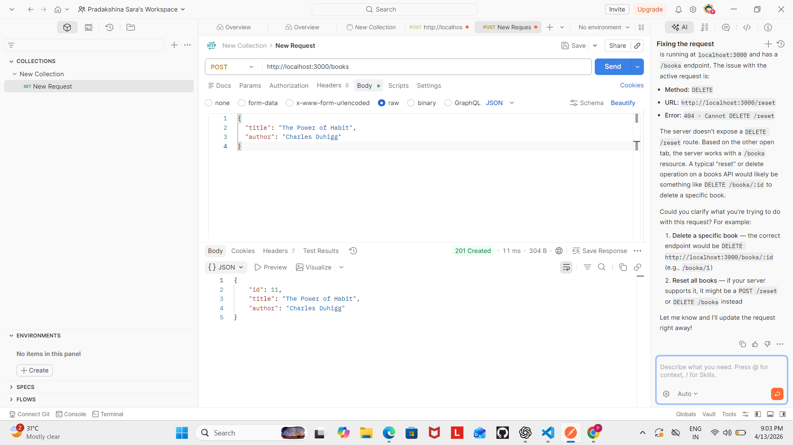
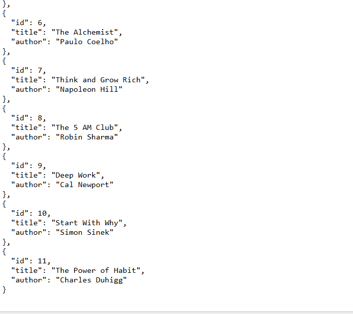

# 📚 Book Management REST API

This project is a simple REST API built using Node.js and Express. It allows users to perform basic CRUD (Create, Read, Update, Delete) operations on a list of books. The data is stored in memory, so no database is required.

---

## 🚀 Features

- View all books  
- Add a new book  
- Update an existing book  
- Delete a book  

---

## 🛠️ Technologies Used

- Node.js  
- Express.js  

---

## 📂 Setup Instructions

1. Clone the repository  

```bash
git clone https://github.com/your-username/book-api.git
cd book-api
Install dependencies
npm install
Run the server
node index.js

Server runs at:
http://localhost:3000

📌 API Endpoints
GET /books → Get all books
POST /books → Add a new book
PUT /books/:id → Update a book
DELETE /books/:id → Delete a book

## 🖼️ Preview

### Server Running


### Add Book


### Get Books

📖 Concepts Covered
REST API basics
Express routing
HTTP methods
JSON handling
CRUD operations


🙌 Author

Pradakshina S
